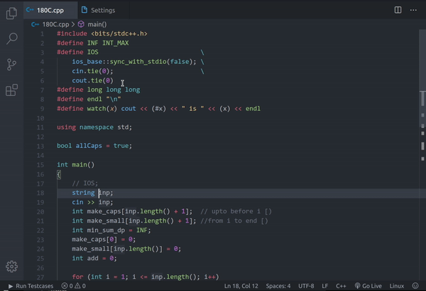
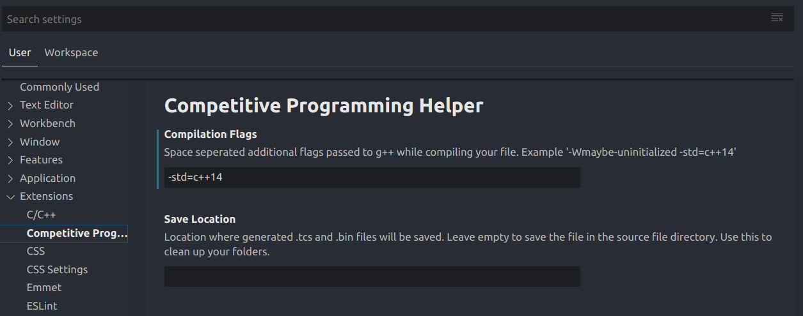

# Competitive Programming Helper

This extension helps you to quickly compile, run and judge your problems.
You can download and run codeforces testcases for a given problem automatically. You can also add custom testcases.

This new version supports an additional language - C.

### Tips

- Use the shortcut `Ctrl + Alt + B` to activate.

- You can choose additional compiler flags and save location from VSCode settings.

Change settings to hoose custom compiler flags and testcase/binary save location.

---

## Usage

Click on the &nbsp; &nbsp;  button on the bottom left of VSCode.

Or

Type `Ctrl/Cmd + Shift + P` and select "_Run Codeforces Testcases Command_".

Or

Use the shortcut `Ctrl/Cmd + Alt + B` to activate.

---

You can edit the generated .tcs ( which is a JSON file ) file to add your own testcases.

## Requirements

The GNU C++ Compiler ( g++ ) and GNU C compiler (gcc ) must be installed and should be accesible from the terminal/command prompt.

## Manual URL Entry ( Optional )

For codeforces, the fist line of your .cpp/.c file should be a sigle line comment of the codeforces url. But you do not need to add it manually, just run the extension and enter in the box displayed.

## About

This extension was created by Divyanshu Agrawal (https://github.com/agrawal-d). Please report bugs by creating an issue using the link above. Thank you for using this extension.

## Support

If you need help using this extension, create an issue [here](https://github.com/agrawal-d) and the developers will get back to you.

---

## Release Notes
- Version 2.2.1
    - Fixed minor settings bug
- Version 2.2.0
    - Added support for C language. ( Overall, now, C and C++ are supported)
- Version 2.1.0
  - Added support for custom compiler flags and generated testcases and binaries storage location.
  - Added usage GIF to readme.
- Version 2.0.X
  - Rich GUI editor for testcases.
- Version 1.0
  - Formatting or results improved. Minor Bug-Fixes.
- Version 0.0.9
  - Handles process exit signals and codes gracefully with detailed output.
- Version 0.0.8i
  - Fixes cross platform checker issues.
- Version 0.0.7
  - Fixes many UI and UX issues
  - Files are auto saved on execution.
  - .bin files are deleted after testcase evauation
  - .testcases files as now .tcs
  - The UI adapts to VS Code theme
- Version 0.0.6
  - Use cheerio for DOM traversal to fix testcase parsing issues.
- Version 0.0.5
  - Add command to open testcase file
  - Grouped all commands by category "Competitive" for easy search
- Version 0.0.4
  - You can now create a testcase file without a codeforces url
  - Prompts for Codeforces URL if not present in first line of C++ file
- Version 0.0.3
  - Testcases are now run sequentially instead of in parallel, giving much more accurate run times.
  - Optimized handling of some special and infinite testcases.
- Version 0.0.2
  - Handles infinite loops, and testcase errors
  - Bugfixes for undefined testcases, parsing errors and more.
- Version 0.0.1
  - Initial Release.
