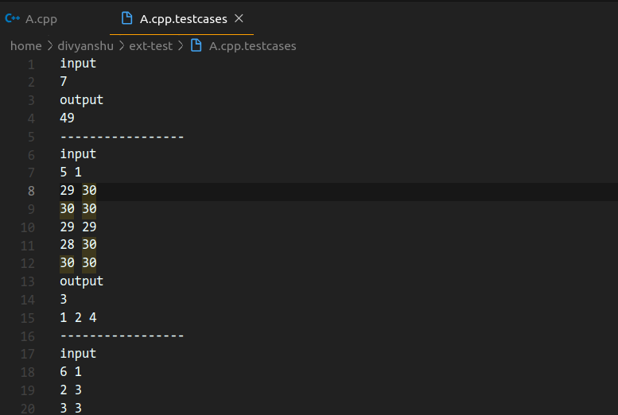
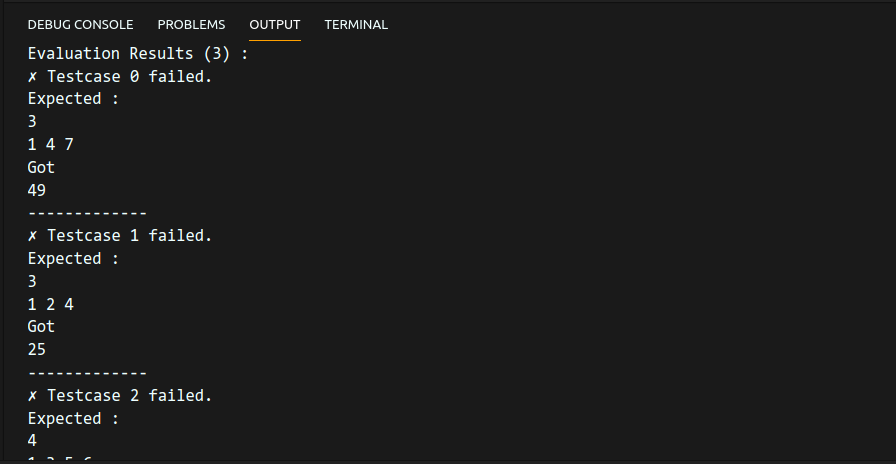
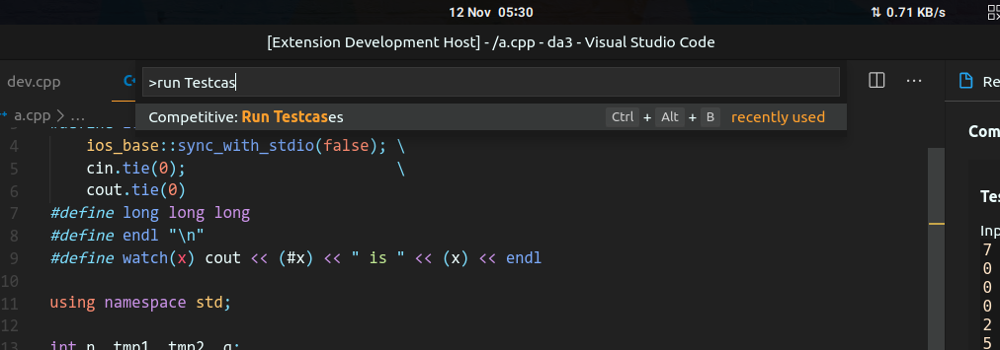

# Competitive Programming Helper (v2.0)

Store link : https://marketplace.visualstudio.com/items?itemName=DivyanshuAgrawal.competitive-programming-helper

This extension helps you to quickly run and judge your problems.
You can download and run codeforces testcases for a given problem automatically. You can also add custom testcases.

This new version has a rich GUI editor for testcases.

* Tip : Use the shortcut ```Ctrl/Cmd + Alt + B``` to activate.


Extension Overview



Rich GUI Editor

-----------------------------------------
## Usage



↑ Press the "Run Testcases" button on bottom left



↑ Type ```Ctrl/Cmd + Shift + P``` and search for "*Run Codeforces Testcases Command*" or Click on the "*Run Testcases*" text on the bottom left of the VSCode ( the bottom statusbar ).


* Or Use the shortcut ```Ctrl/Cmd + Alt + B``` to activate.

* The first line of your C++ code should be a comment containing the URL of the codeforces page. The comment should be single line, ie,  start with ```//``` and not ```/*```

* You can edit the generated .tcs ( which is a JSON file ) file to add your own testcases.

## Requirements

The GNU C++ Compiler ( GCC ) must be installed and should be accesible from the terminal/command prompt.

## Manual URL Entry ( Optional )

For codeforces, the fist line of your .cpp file should be a sigle line comment of the codeforces url. But you do not need to add it manually, just run the extension and enter in the box displayed.

## About
This extension was created by Divyanshu Agrawal (https://github.com/agrawal-d). Please report bugs to hereisdx@gmail.com. Thank you for using this extension.

_____________________________

## Release Notes
* Version 2.0.X
    * Rich GUI editor for testcases
* Version 1.0
    * Formatting or results improved. Minor Bug-Fixes.
* Version 0.0.9
    * Handles process exit signals and codes gracefully with detailed output.
* Version 0.0.8i
    * Fixes cross platform checker issues.
* Version 0.0.7
    * Fixes many UI and UX issues
    * Files are auto saved on execution.
    * .bin files are deleted after testcase evauation
    * .testcases files as now .tcs
    * The UI adapts to VS Code theme
* Version 0.0.6
    * Use cheerio for DOM traversal to fix testcase parsing issues.
* Version 0.0.5
    * Add command to open testcase file
    * Grouped all commands by category "Competitive" for easy search
* Version 0.0.4
    * You can now create a testcase file without a codeforces url
    * Prompts for Codeforces URL if not present in first line of C++ file
* Version 0.0.3
    * Testcases are now run sequentially instead of in parallel, giving much more accurate run times.
    * Optimized handling of some special and infinite testcases.
* Version 0.0.2
    * Handles infinite loops, and testcase errors
    * Bugfixes for undefined testcases, parsing errors and more.
* Version 0.0.1
    * Initial Release.