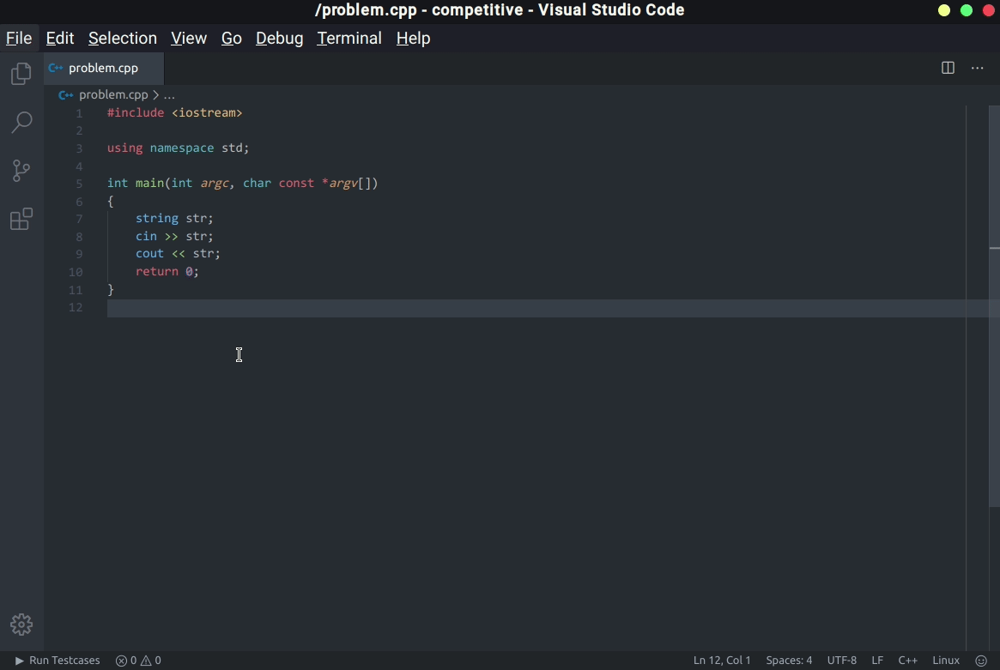
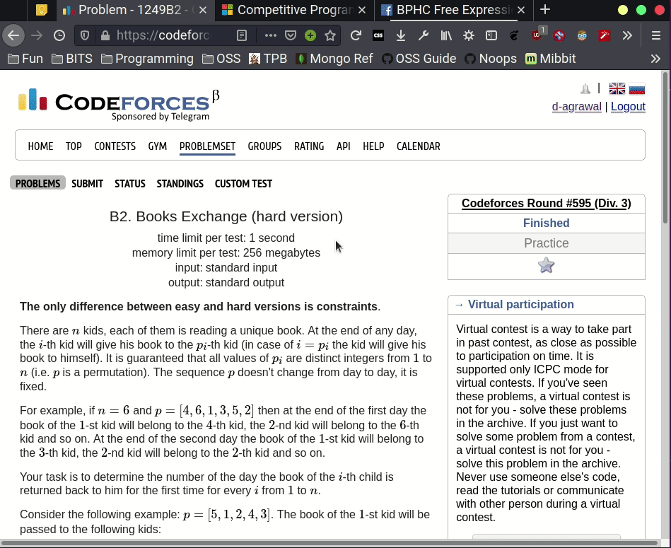
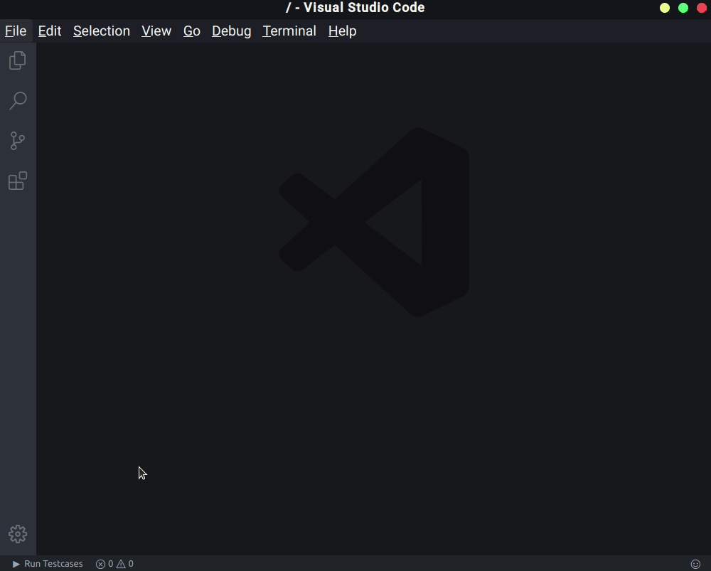

# Competitive Programming Helper

   

Quickly compile, run and judge competitive programming problems. Add testcases manually or Download automatically.

Supports tons of websites including AtCoder, Codeforces, Codechef, UVa Online Judge and more!

**Whats new :** Now supports Rust (experimental) and Python 3!

Manual Usage

## Competitive Companion support

Click on the  on your browser address bar to automatically download testcases and create .cpp file. You need to install the competitive companion extension to use this, and [set it up](#competitive-companion-setup).

### Tips

- Use the shortcut `Ctrl + Alt + B` to activate.
- You can choose additional compiler flags and save location from VSCode settings.
- You can choose a default language that will be used when you import a problem through Competitive Companion from VSCode settings.

Change settings to hoose custom compiler flags and testcase/binary save location and more.

## Competitive Companion Setup

It is simple to use Competitive Companion with this extenison.

1. Download Competitive Companion for your browser : [Firefox](https://addons.mozilla.org/en-US/firefox/addon/competitive-companion/) [Google Chrome](https://chrome.google.com/webstore/detail/competitive-companion/cjnmckjndlpiamhfimnnjmnckgghkjbl)

1. That's it! Now just open a problem page, click on the  in the browser add-ons area to download problem and testcases. You must open VS Code in a folder to use this. To open in a folder, just press `File> Open Folder` or `Ctrl+K then Ctrl+O`.

## How to use

- Click on the  button on the bottom left of VSCode.

- Or Type `Ctrl+ Shift + P` and select "_Run Testcases Command_".

- Or Use the shortcut `Ctrl + Alt + B` to activate.

- When focused on the results screen, press `Ctrl + Alt + N` to create a new testcase.

## Dependencies

* gcc, g++, python3 and rustc must be installed and should be accesible from the terminal/command prompt for support of their languages.
* For competitive companion support, download the extension.
* Rust support is experimental!

## About

* This extension is maintained by [agrawal-d](https://github.com/agrawal-d). It would not have been possible to make this without the help of other [Contributors](#Contributors)!

* Please report bugs by creating an issue using the link above. Thank you for using this extension.

## Support

If you need help using this extension, create an issue [here](https://github.com/agrawal-d) and the developers will get back to you.

## Contributors

* Huge thanks to [mr2rm](https://github.com/mr2rm) for working on Python3 support and doing major refactors and code cleanup.

* Thanks to [predator810](https://github.com/predator810) for adding default language setting.
