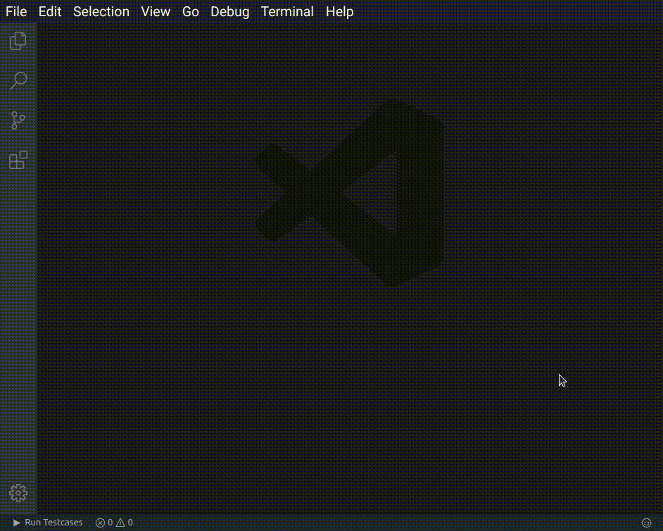

# Competitive Programming Helper

](https://img.shields.io/visual-studio-marketplace/v/DivyanshuAgrawal.competitive-programming-helper?style=for-the-badge&logo=visual-studio-code)   

Quickly compile, run and judge competitive programming problems. Download and testcases for a given problem automatically and/or add custom testcases.

Supports tons of websites including AtCoder, Codeforces, Codechef, UVa Online Judge and more!

**Whats new :** This new feature adds a new shortcut for adding new testcase - `Ctrl+Alt+N` (only when you are focused in the results screen). Also includes bugfixes, and genreal UX improvements including new animations!

Manual Usage

## Competitive Companion support

Click on the  on your browser address bar to automatically download testcases and create .cpp file. You need to install the competitive companion extension to use this, and [set it up](#competitive-companion-setup).

### Tips

- Use the shortcut `Ctrl + Alt + B` to activate.
- You can choose additional compiler flags and save location from VSCode settings.

Change settings to hoose custom compiler flags and testcase/binary save location and more.

## Competitive Companion Setup

It is simple to use Competitive Companion with this extenison.

1. Download Competitive Companion for your browser : [Firefox](https://addons.mozilla.org/en-US/firefox/addon/competitive-companion/) [Google Chrome](https://chrome.google.com/webstore/detail/competitive-companion/cjnmckjndlpiamhfimnnjmnckgghkjbl)

1. That's it! Now just open a problem page, click on the  in the browser add-ons area to download problem and testcases. You must open VS Code in a folder to use this. To open in a folder, just press `File> Open Folder` or `Ctrl+K then Ctrl+O`.

**(See [firefox help video](https://github.com/agrawal-d/competitive-programming-helper/blob/master/screenshots/companion-help-firefox.webm?raw=true) or [chrome help video](https://github.com/agrawal-d/competitive-programming-helper/blob/master/screenshots/companion-help-chrome.webm?raw=true))**

## How to use

- Click on the  button on the bottom left of VSCode.

- Or Type `Ctrl+ Shift + P` and select "_Run Testcases Command_".

- Or Use the shortcut `Ctrl + Alt + B` to activate.

- When focused on the results screen, press `Ctrl + Alt + N` to create a new testcase.

## Dependencies

The GNU C++ Compiler ( g++ ) and GNU C compiler (gcc ) must be installed and should be accesible from the terminal/command prompt.
For competitive companion support, download the extension.

## About

This extension was created by Divyanshu Agrawal (https://github.com/agrawal-d). Please report bugs by creating an issue using the link above. Thank you for using this extension.

## Support

If you need help using this extension, create an issue [here](https://github.com/agrawal-d) and the developers will get back to you.

## Release Notes

Release notes are no longer maintained.
