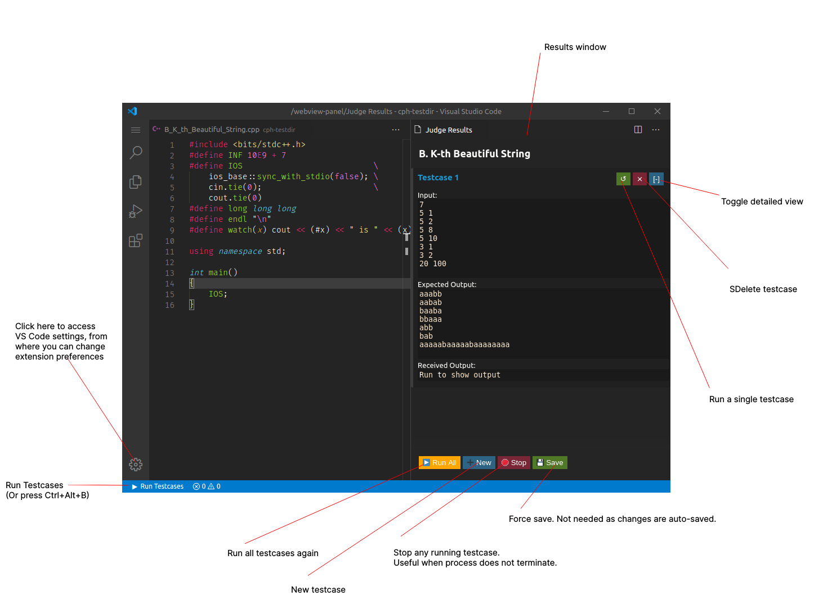
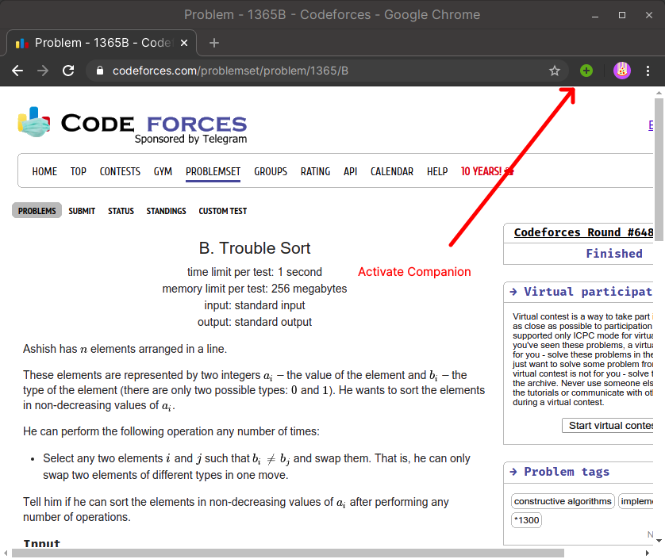
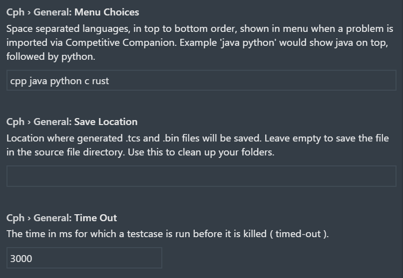
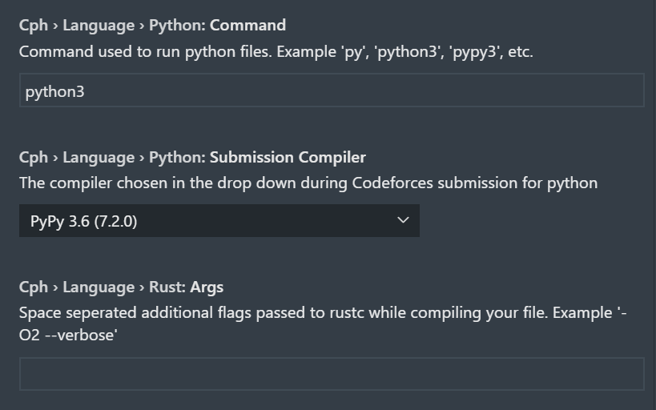

# cph user guide

This document contains instructions on how to use this extension.

## UI explained



This image is outdated. Please refer to README for an updated UI. The button
actions remain the same.

## Using with competitive companion

1. [Install cph](https://marketplace.visualstudio.com/items?itemName=DivyanshuAgrawal.competitive-programming-helper)
   by following the instructions given in the link.

1. [Install competitive companion](https://github.com/jmerle/competitive-companion#readme)
   browser extension in your browser, using the instructions given in the link.

1. Open any folder in VS Code (Menu>File>Open Folder).

1. Use Companion by pressing the green plus (+) circle from the browser toolbar
   when visiting any problem page.

    

1. The file opens in VS Code with testcases preloaded. Press `Ctrl+Alt+B` to run
   them. Or, use the 'Run Testcases' button from the activity bar ( in the
   bottom).

## Using with your own problems

1. Write some code in any supported language ( .cpp, .c, .rs, .python).

1. Launch the extension: Press `Ctrl+Alt+B` to run them. Or, use the 'Run
   Testcases' button from the activity bar ( in the bottom).

1. Enter your testcases in the window opened to the side.

1. Then, you can run them.

## Submit to Codeforces

1. Install [cph-submit](https://github.com/agrawal-d/cph-submit) on Firefox.
1. After installing, make sure a browser window is open.
1. Click on the 'Submit to CF' button in the results window.
1. A tab opens in the browser and the problem is submitted.

## Submit to Kattis

1. Install Kattis [config file](https://open.kattis.com/download/kattisrc) and
   [submission client](https://open.kattis.com/download/submit.py?e48b42=). Make
   sure you are logged in on another tab prior to accessing the files.

2. Move these files to a directory(folder) called .kattisrc in your home
   directory.

    1. On MacOS, this is typically /Users/{username}/.kattisrc
    2. On Linux, this is typically /home/{username}/.kattisrc
    3. On Windows, this is typically C:\Users\\{username}\\.kattisrc

3. If any errors come up, check which directory `~` is linked to, by running

    ```bash
    python -c "import os; print(os.path.expanduser('~'))"
    ```

    in a terminal.

4. Click on the 'Submit to Kattis' button in the results window.

5. A new tab will open in the browser with the submissions page.

## Environment

-   For C++, `DEBUG` and `CPH` are defined as a `#define` directive.

## Customizing preferences

Several options are available to customize the extension. Open VS Code settings
(From the gear icon on bottom-left) and go to the
'competitive-programming-helper' section. You can choose several settings like:


### General Settings

\


-   Default save location for generated meta-data.
-   Default language selected for new problems imported via Competitive
    Companion.
-   Language choices offered in menu when new problem imported via Competitive
    Companion.
-   Timeout for testcases.

### Language Settings (for each language)

\


-   Additional compilation flags.
-   [Requires [cph-submit](#submit-to-codeforces)] Compiler selected in drop
    down during codeforces submission.
-   [Python] Command used to run python files. For eg. py, python3, pypy3, etc.

## Getting help

If you have trouble using the extension, find any bugs, or want to request a new
feature, please create an issue [here](https://github.com/agrawal-d/cph/issues).
