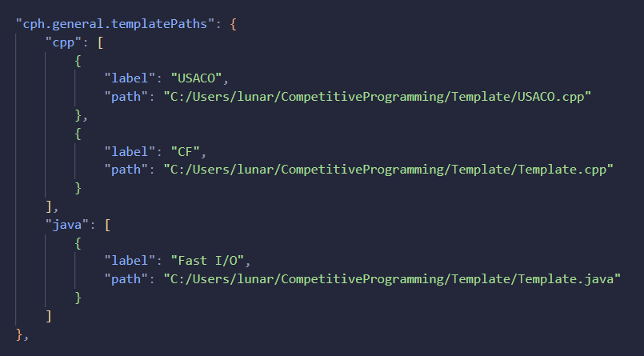

# CPH User Guide

This document contains instructions on how to use this extension. UI information
can be found in the README.

## Using competitive companion

1. [Install cph](https://marketplace.visualstudio.com/items?itemName=DivyanshuAgrawal.competitive-programming-helper)
   by following the instructions given in the link.
2. [Install competitive companion](https://github.com/jmerle/competitive-companion#readme)
   browser extension in your browser, using the instructions given in the link.
3. Open any folder in VS Code (Menu>File>Open Folder).
4. Use Companion by pressing the green plus (+) circle from the browser toolbar
   when visiting any problem page.


1. The file opens in VS Code with testcases preloaded. Press `Ctrl+Alt+B` to run
   them. Or, use the 'Run Testcases' button from the activity bar (in the
   bottom).

## Making your own problems

1. Write some code in any supported language ( .cpp, .c, .rs, .python).
2. Launch the extension: Press `Ctrl+Alt+B` to run them. Or, use the 'Run
   Testcases' button from the activity bar (in the bottom).
3. Enter your testcases in the window opened to the side.
4. Then, you can run them.

## Submitting to Codeforces

1. Install [cph-submit](https://github.com/agrawal-d/cph-submit) on Firefox.
2. After installing, make sure a browser window is open.
3. Click on the 'Submit to CF' button in the results window.
4. A tab opens in the browser and the problem is submitted.

## Submit to Kattis

1. Install Kattis [config file](https://open.kattis.com/download/kattisrc) and
   [submission client](https://github.com/Kattis/kattis-cli). Make sure you are
   logged in on another tab prior to accessing the files.
2. Move these files to a directory(folder) called .kattisrc in your home
   directory.

> On MacOS, this is typically /Users/{username}/.kattisrc On Linux, this is
> typically /home/{username}/.kattisrc On Windows, this is typically
> C:\Users\\{username}\\.kattisrc

3. If any errors come up, check which directory `~` is linked to, by running
   `python -c "import os; print(os.path.expanduser('~'))"` in a terminal.
4. Click on the 'Submit to Kattis' button in the results window.
5. A new tab will open in the browser with the submissions page.

## Environment

For C++, `DEBUG` and `CPH` are defined as a `#define` directive.

## Customizing preferences

Several options are available to customize the extension. Open VS Code settings
(From the gear icon on bottom-left) and go to the
'competitive-programming-helper' section. You can choose several settings like:


### General Settings


-   Default save location for generated meta-data.
-   Default language selected for new problems imported via Competitive
    Companion.
-   Language choices offered in menu when new problem imported via Competitive
    Companion.
-   Timeout for testcases.

### Language Settings (for each language)


-   Additional compilation flags.
-   [Requires [cph-submit](#submit-to-codeforces)] Compiler selected in drop
    down during codeforces submission.
-   [Python] Command used to run python files. For eg. py, python3, pypy3, etc.

## Default Language Templates

-   Support for multiple template files for each language and default templates
    (by only putting a single template for any given language)
-   In your `settings.json` file, insert your template file paths as shown
    below. Your file paths must use either double backslashes or forward slashes
    to be valid. (e.g.
    `"path": "C:/Users/lunarzDev/CompetitiveProgramming/Templates/Template.cpp"`)
-   For Java templates, please name the class `CLASS_NAME,` so it can be
    properly assigned to the same name as the file. Please note that the Java
    file name may be something other than `CLASS_NAME`, so you can create
    multiple unique templates.

```json
"cph.general.templatePaths": {
    "cpp": [
        {
            "label": "Template Name 1",
            "path": "<path-to-your-cpp-template>"
        },
        {
            "label": "Template Name 2",
            "path": "<path-to-your-cpp-template>"
        }
    ],
    "java": [
        {
            "label": "Default Java Template",
            "path": "<path-to-your-java-template>"
        }
    ]
}
```



## Getting help

If you have trouble using the extension, find any bugs, or want to request a new
feature, please create an issue [here](https://github.com/agrawal-d/cph/issues).
