# cph user guide

This document contains instructions on how to use this extension.

## UI explained

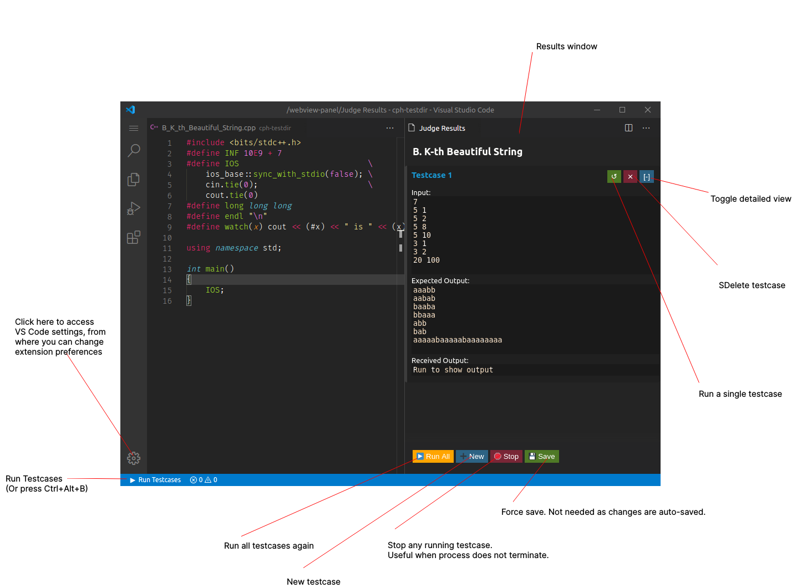

This image is outdated. Please refer to README for an updated UI. The button
actions remain the same.

## Using with competitive companion

1. [Install cph](https://marketplace.visualstudio.com/items?itemName=DivyanshuAgrawal.competitive-programming-helper)
   by following the instructions given in the link.

1. [Install competitive companion](https://github.com/jmerle/competitive-companion#readme)
   browser extension in your browser, using the instructions given in the link.

1. Open any folder in VS Code (Menu>File>Open Folder).

1. Use Companion by pressing the green plus (+) circle from the browser toolbar
   when visiting any problem page.

    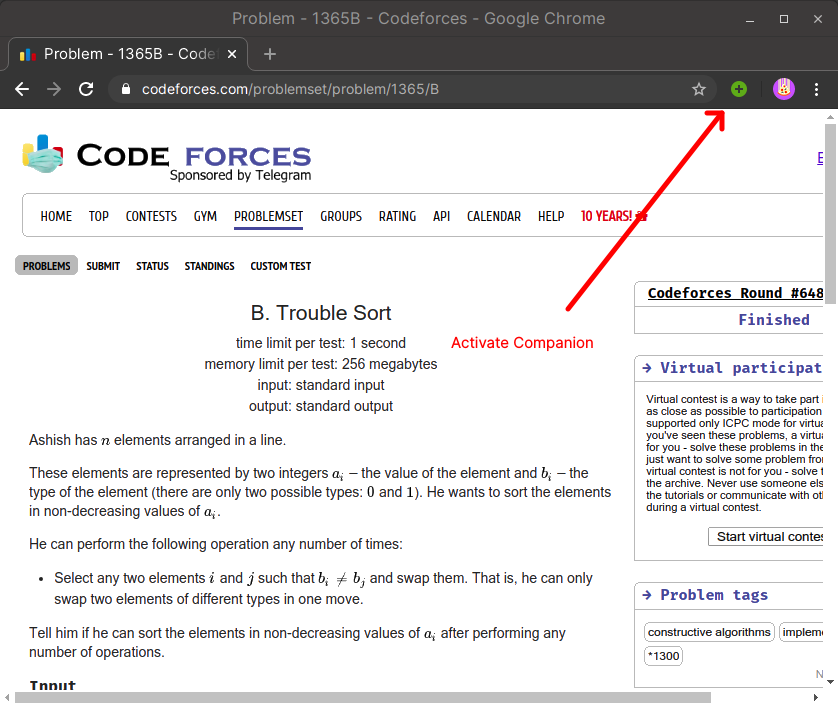

1. The file opens in VS Code with testcases preloaded. Press `Ctrl+Alt+B` to run
   them. Or, use the 'Run Testcases' button from the activity bar ( in the
   bottom).

## Using with your own problems

1. Write some code in any supported language ( .cpp, .c, .rs, .python).

1. Launch the extension: Press `Ctrl+Alt+B` to run them. Or, use the 'Run
   Testcases' button from the activity bar ( in the bottom).

1. Enter your testcases in the window opened to the side.

1. Then, you can run them.

## Submit to Codeforces

1. Install [cph-submit](https://github.com/agrawal-d/cph-submit) on Firefox.
1. After installing, make sure a browser window is open.
1. Click on the 'Submit to CF' button in the results window.
1. A tab opens in the browser and the problem is submitted.

## Submit to Kattis

1. Install Kattis [config file](https://open.kattis.com/download/kattisrc) and
   [submission client](https://github.com/Kattis/kattis-cli). Make sure you are
   logged in on another tab prior to accessing the files.

2. Move these files to a directory(folder) called .kattisrc in your home
   directory.

    1. On MacOS, this is typically /Users/{username}/.kattisrc
    2. On Linux, this is typically /home/{username}/.kattisrc
    3. On Windows, this is typically C:\Users\\{username}\\.kattisrc

3. If any errors come up, check which directory `~` is linked to, by running

    ```bash
    python -c "import os; print(os.path.expanduser('~'))"
    ```

    in a terminal.

4. Click on the 'Submit to Kattis' button in the results window.

5. A new tab will open in the browser with the submissions page.

## Custom Checker (Special Judge)

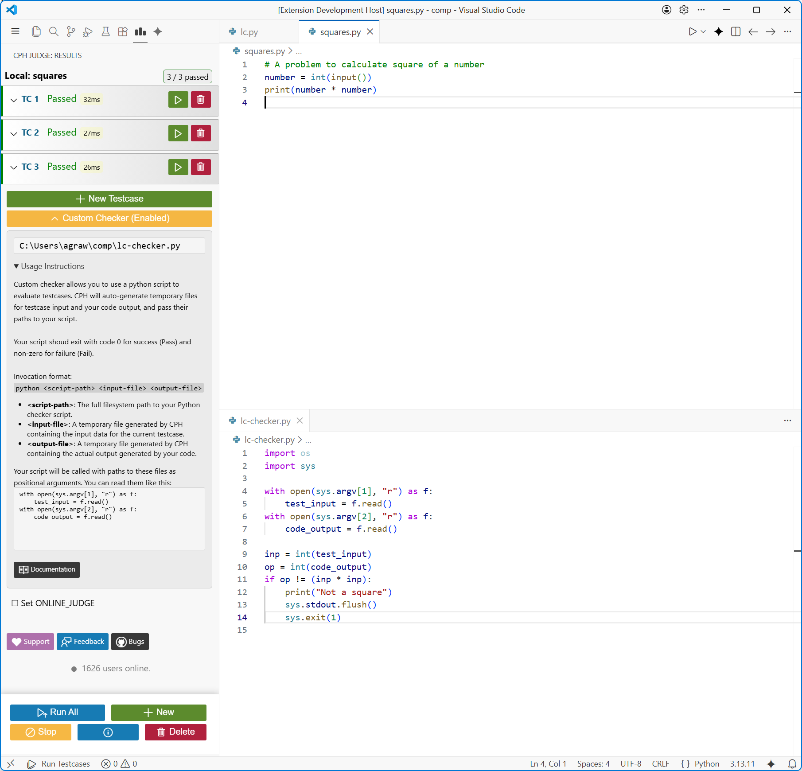

CPH provides a powerful "Custom Checker" feature, often referred to as a
**Special Judge (SPJ)**. This is essential for problems where:

-   There are multiple valid outputs (e.g., "Find any path...").
-   Floating-point comparisons require a specific precision (epsilon).
-   The problem involves complex verification that the standard "Exact Match"
    judge cannot handle.

### How it Works

When you enable a custom checker, CPH bypasses its internal judging logic and
delegates the decision to your script.

1.  **Activation**: Click the **"Custom Checker"** button in the judge view.
    This will reveal the configuration area.
2.  **Path Configuration**: Enter the **full filesystem path** to your Python
    script (e.g., `/home/user/checker.py` or `C:\scripts\judge.py`).
3.  **UI Changes**: Once enabled, the "Expected Output" field for all test cases
    will be visually hidden to indicate it is no longer being used for judging.
4.  **Auto-Focus**: Clicking the "Custom Checker (Enabled)" button will
    automatically focus the path input field for quick editing.

### Nuances of Execution

Your checker script is executed independently for **each** test case that runs
successfully.

-   **Language**: Currently, only **Python** scripts are supported. CPH uses
    your configured Python command (from settings) to run the script.
-   **Data Passing**: Data is passed to your script via **temporary files**
    rather than standard input. This ensures large inputs/outputs are handled
    robustly without shell buffer limits.
-   **Temporary Files**: CPH creates two unique temporary files in your system's
    temp directory for every run:
    -   `cph-input-[random].txt`: Contains the raw input for the test case.
    -   `cph-output-[random].txt`: Contains the raw output emitted by your
        solution.
    -   _Note: These files are automatically deleted by CPH immediately after
        the checker finishes._
-   **Invocation Format**: Your script is invoked using three positional
    arguments: `python <script-path> <input-file> <output-file>`
    1.  `argv[0]`: The path to your checker script itself.
    2.  `argv[1]`: The path to the CPH-generated **input** file.
    3.  `argv[2]`: The path to the CPH-generated **output** file.

### Judging Logic & Results

-   **Pass/Fail**: The result of the test case is determined solely by your
    script's **exit code**:
    -   **Exit Code `0`**: The test case is marked as **Passed**.
    -   **Non-zero Exit Code**: The test case is marked as **Failed**.
-   **Checker Logs**: Any output your script prints to `STDOUT` or `STDERR` is
    captured by CPH. You can view these logs by expanding the **"Checker Log"**
    section for a specific test case in the UI. This is invaluable for debugging
    why a specific case failed.

### Robust Example Script

Here is a recommended boilerplate for a custom checker that handles file reading
and basic logic:

```python
import sys

def judge():
    try:
        # Argument 1 is the testcase input file
        with open(sys.argv[1], "r") as f:
            test_input = f.read().strip()

        # Argument 2 is your code's actual output file
        with open(sys.argv[2], "r") as f:
            code_output = f.read().strip()

        # --- YOUR JUDGING LOGIC HERE ---
        # Example: Check if the output is the square of the input
        val = int(test_input)
        ans = int(code_output)

        if ans == val * val:
            print("Correct: Output matches expected square.")
            sys.exit(0) # PASS
        else:
            print(f"Error: Expected {val*val}, got {ans}")
            sys.exit(1) # FAIL

    except Exception as e:
        print(f"Checker Error: {e}")
        sys.exit(1) # FAIL on script error

if __name__ == "__main__":
    judge()
```

### Best Practices & Tips

-   **Full Paths**: Always use absolute paths for the checker script to avoid
    ambiguity.
-   **Debugging**: Use `print()` statements in your Python script; they will
    appear in the **Checker Log** within CPH.
-   **Error Handling**: Wrap your logic in a `try-except` block to ensure the
    checker doesn't crash silently and provides a useful error message in the
    logs.
-   **Exit Codes**: Ensure your script _explicitly_ calls `sys.exit(0)` or
    `sys.exit(1)`. Some Python environments might return `0` by default even on
    some logical errors if not specified.

## Environment

## Environment

-   For C++, `DEBUG` and `CPH` are defined as a `#define` directive.

## Customizing preferences

Several options are available to customize the extension. Open VS Code settings
(From the gear icon on bottom-left) and go to the
'competitive-programming-helper' section. You can choose several settings like:

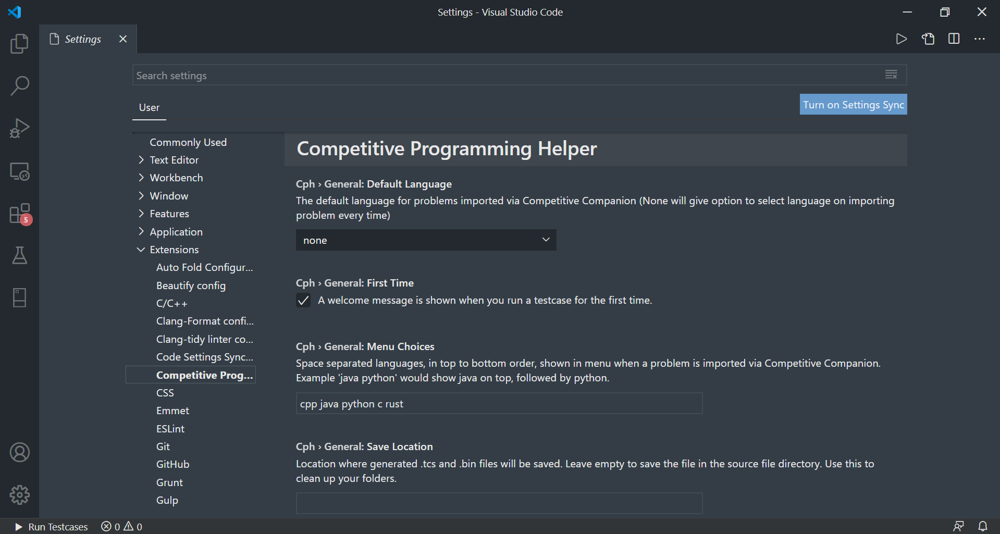

### General Settings

\
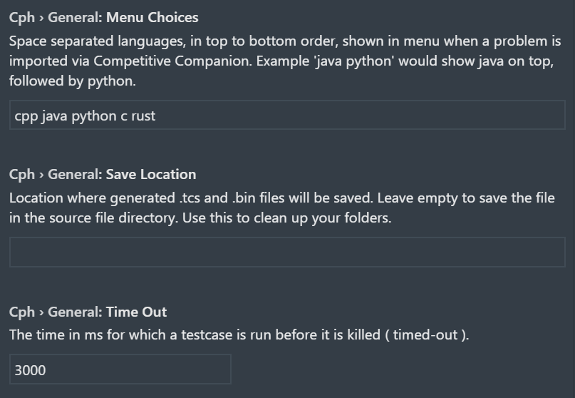

-   Default save location for generated meta-data.
-   Default language selected for new problems imported via Competitive
    Companion.
-   Language choices offered in menu when new problem imported via Competitive
    Companion.
-   Timeout for testcases.

### Codeforces Filename Style

Controls how filenames are generated for Codeforces problems.

-   Example problem: `1901A - A. Line Trip`
-   `name` → `A_Line_Trip.cpp`
-   `shortcode` → `1901A.cpp`
-   `both` → `1901A_Line_Trip.cpp`
-   `legacy` preserves the existing behavior and works with the
    `Use Short Codeforces Name` setting.

### Language Settings (for each language)

\
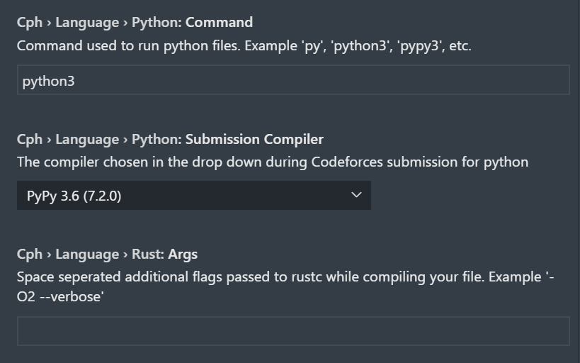

-   Additional compilation flags.
-   [Requires [cph-submit](#submit-to-codeforces)] Compiler selected in drop
    down during codeforces submission.
-   [Python] Command used to run python files. For eg. py, python3, pypy3, etc.

## Default Language Templates

-   The path of the template that will be loaded when a new file of the default
    language is created by Competitive Companion.
-   For Java Users, the template shall be in the format where class name is
    `CLASS_NAME` as the file name so that CLASS_NAME in the code gets auto
    replaced.
-   **Cursor Placement**: You can place `$CURSOR_PLACEHOLDER` in your template.
    When a new file is created, the cursor will automatically be moved to this
    position, and the placeholder string will be removed.
    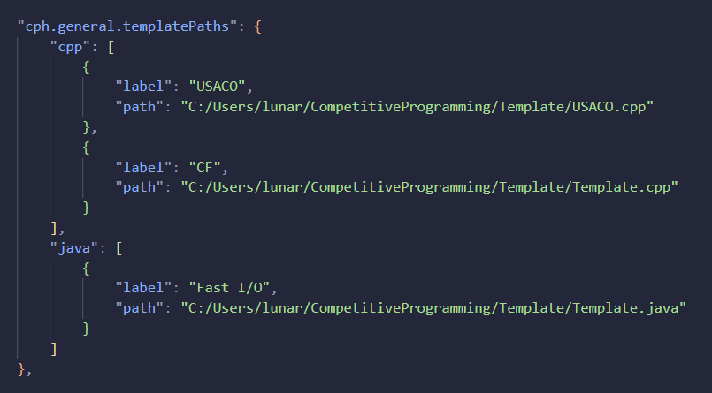 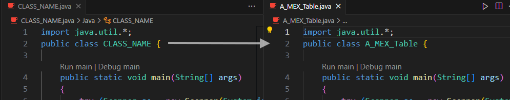

### Template Variable Replacement

-   Replace the pattern $var$ with its value when creating files with
    Competitive Companion
-   For example:
    -   $name$ - problem name
    -   $url$ - problem url
    -   $date$ - local date in YYYY-MM-DD
    -   $time$ - local time in HH:MM:SS
-   For a full list, turn on debug mode in the Competitive Companion extension
    preferences (Right Click on Extension>Manage extension>Preferences) and use
    the JSON keys shown in the console (F12 > Navigate to the Console tab) after
    activating it 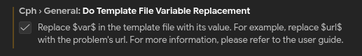
    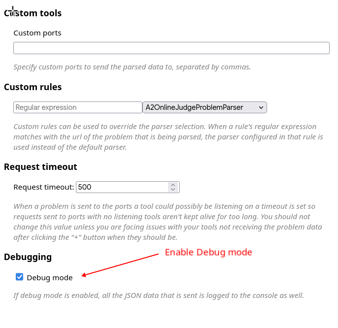 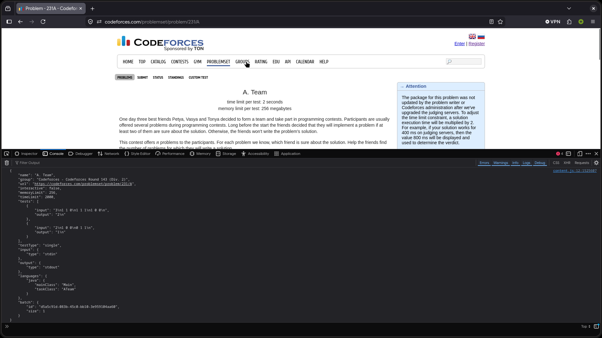

## Getting help

If you have trouble using the extension, find any bugs, or want to request a new
feature, please create an issue [here](https://github.com/agrawal-d/cph/issues).
